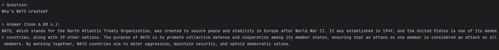

# dgpt
Too lazy to search your data? lets GPT do it

## Install
using requirements.txt

Remember replace the .env-example with your own .env file and change `API_KEY` to your own API key `sk-...`
```bash
cp .env-example .env
pip install -r requirements.txt
```

Prepare your data in `PREPROCESSING_FILE` and update `PREPROCESSING_FILE` in `.env` file
## Usage
```bash
python src/chat.py
```
